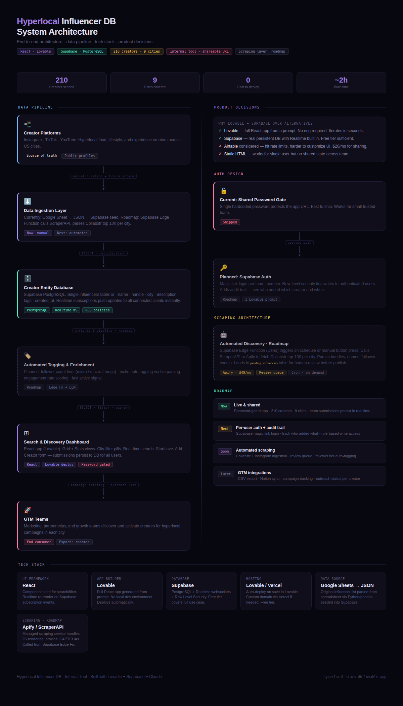

# Creator Intelligence Database

Creator intelligence database that structures influencers by city, niche, and engagement signals for GTM teams.

---

## Problem

Marketing and GTM teams spend significant time manually researching creators across platforms. Discovery is fragmented across Instagram, TikTok, YouTube, and agency lists, making it difficult to identify creators by city, niche, or audience profile.

---

## Solution

A structured creator intelligence database that organizes influencers by:

- City / geography  
- Audience niche  
- Engagement metrics  
- Platform presence  

The system enables GTM teams to quickly discover and segment creators for partnerships and campaigns.

---

## Key Features

- City-level creator discovery  
- Automated audience niche tagging  
- Engagement signal tracking  
- Cross-platform creator profiles  
- Searchable internal dashboard  

---

## Prototype

An interactive prototype was built to test:

- creator discovery workflow  
- tagging taxonomy  
- segmentation by city and niche  

before engineering implementation.

---

## Data Model

### Core Entity Structure

Creator

- Name  
- Platform  
- City  
- Audience niche  
- Engagement rate  
- Follower count  
- Contact / representation  

---

## System Architecture

**Live app → [hyperlocal-stars-db.lovable.app](https://hyperlocal-stars-db.lovable.app)**

---

## Future Development

- Creator campaign performance tracking  
- Web scraping new creators  
- Brand partnership scoring  
- Trend detection across cities  
- Outreach workflow automation
